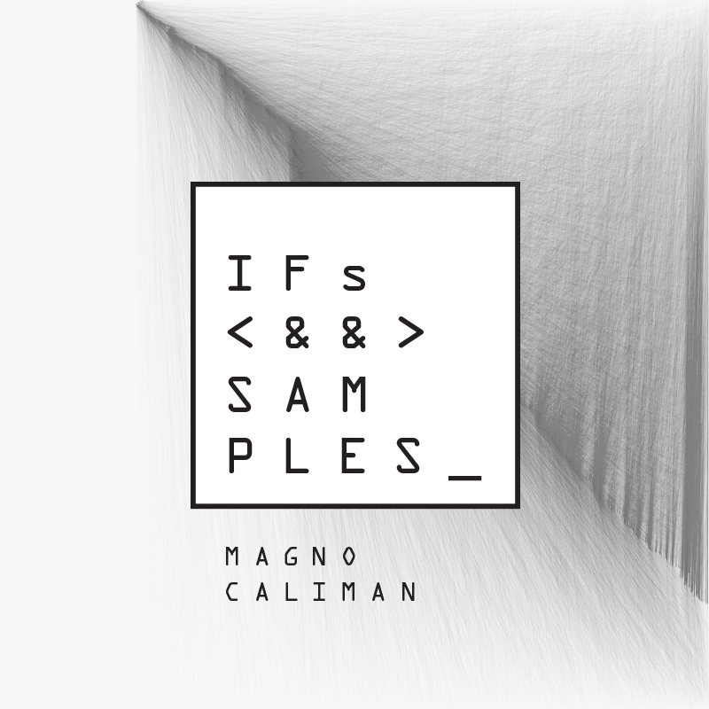

Aqui está o início de algo.

O material desse site se apresenta como o resultado do término de uma pesquisa. Acredito, entretanto, que ele deve ser lido muito mais enquanto _introdução_, do que como _conclusão_. Fruto de um percurso de experimentação de formatos e abordagens, aqui está um primeiro passo na tentativa de delinear estratégias para o ensino e aprendizagem de programação criativa.

Um processo assumidamente não finalizado, disponibilizo esse conteúdo em caráter _beta_ na esperança de que, primeiramente, o material seja útil e tenha alguma vida "além-muro" na prática artística de quem quer que seja. Em seguida, torno acessível esperando confrontar uma esperada validade pedagógica do material com outras realidades e práticas docentes distintas das minhas - quem sabe recebendo algum retorno que contribua para melhorias em versões futuras.

O núcleo central desse material consiste de cinco projetos no campo da computação musical: apresentação dos ambientes de programação _Max_ e _SuperCollider_; implementação do método de síntese por _modulação em anel_; simulação digital da manipulação concreta da _cabeça de leitura_ de um reprodutor de fita; _sampler_ autômato de melodias e ritmos generativos; e sintetizador de _síntese aditiva_ capaz de transitar entre uma série perfeitamente harmônica, e altamente inarmônica.

A produção desses projetos (concepção, implementação, produção de videos, etc.) constitui o cerne principal do trabalho, para onde a maioria esmagadora dos esforços foram desprendidos. Porém, incluo alguns esboços de material escrito sobre alguns tópicos em teoria da computação, adaptados de textos pessoais que uso como referência para montagem das minhas próprias aulas. Se tratam de textos incompletos, que se alteram a cada aula ministrada, com anotações em forma de tópicos e questionamentos meus para mim mesmo. Se tratam, de fato, de rascunhos públicos.
De toda forma, os incluo aqui por acreditar que eles ilustram parte do ideário metodológico e pedagógico que foi base para concepção desse projeto, e também como forma de reforçar a potencialidade de um material em caráter abertamente _beta_, passível de construção coletiva.

---

Todo o conteúdo desse material é distribuído através de uma licença [WTFPL](http://www.wtfpl.net/about/).

Para contato: ifsandsamples [arroba] gmail.com

