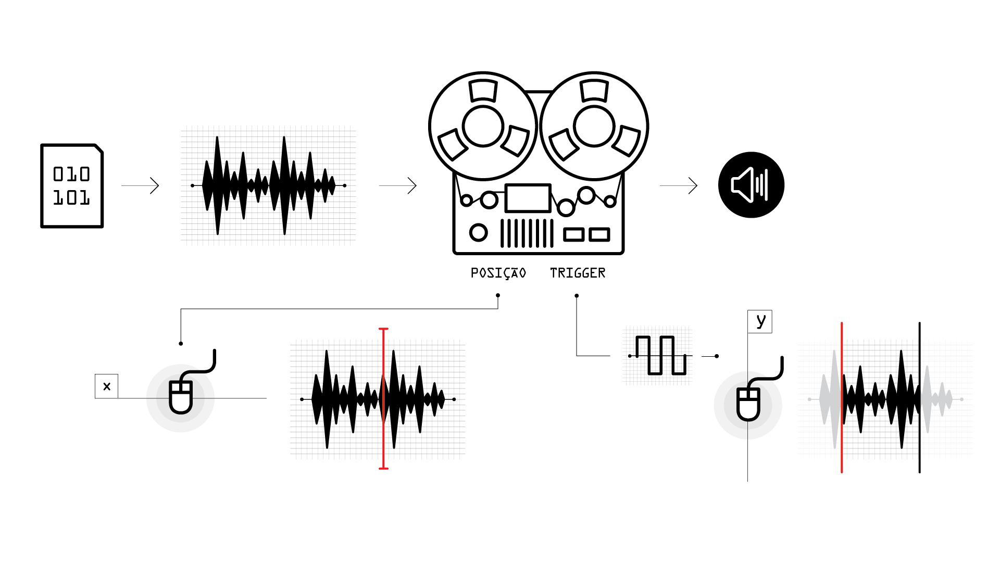

# Cabeça de Leitura

BfoE1mYKj04

Caso player acima não funcione, acessar o video [nesse link.](https://youtu.be/BfoE1mYKj04)

---

>Criação de um programa que controla a reprodução de um arquivo de áudio a partir das posições vertical e horizontal do mouse. Uma simulação virtual da manipulação concreta da cabeça de leitura de um tocador de fita e/ou agulha leitora de um reprodutor de discos de vinil.

---

No campo do som, alguns tópicos de leitura relevantes para esse projeto:

* [Comprimento de onda](https://en.wikipedia.org/wiki/Wavelength)
* [Turntablism](https://en.wikipedia.org/wiki/Turntablism) && [Pierre Schaeffer](https://en.wikipedia.org/wiki/Pierre_Schaeffer)
* [Síntese granular](https://en.wikipedia.org/wiki/Granular_synthesis)

No campo da computação, alguns tópicos de leitura relevantes para esse projeto:

* <a href="https://en.wikipedia.org/wiki/Scope_(computer_science)">Escopo de variáveis</a>
* [Buffers de dados](https://en.wikipedia.org/wiki/Data_buffer)
* <a href="https://en.wikipedia.org/wiki/Parameter_(computer_programming)">Argumentos</a>
<!-- * [Argumentos](https://en.wikipedia.org/wiki/Parameter_(computer_programming\)) -->

---

Os códigos desse projeto podem ser baixados [aqui.](https://drive.google.com/open?id=1w4zPUHEkLPasit2R2XbVzYJIvLt4t5_4)

### Desafios sugeridos

É altamente recomendado que você explore e faça alterações, por conta própria, nos códigos apresentados nesse projeto. 
Aqui estão algumas sugestões de novas funcionalidades e/ou modificações que podem ser implementadas:

- Use samples de diferentes durações: desde vários minutos até frações de segundo.
- Experimente, além da posição do mouse, diferentes formas de controle sobre o parâmetro de posição de leitura do buffer, como um [random walk](https://en.wikipedia.org/wiki/Random_walk).
- Implemente um [loop](https://en.wikipedia.org/wiki/Control_flow#Loops) com diferentes leituras simultâneas do buffer, onde cada leitura possui uma taxa levemente diferente, simulando um princípio de [chorus](https://en.wikipedia.org/wiki/Chorus_effect)
