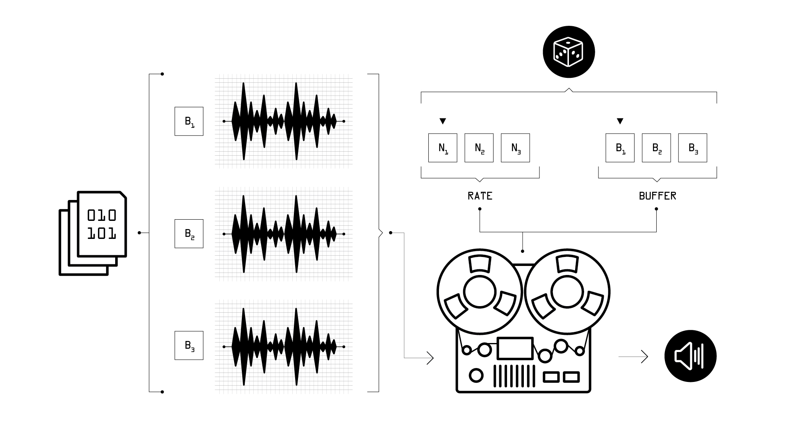

# Sampler

Q3rwUPyCqmg

Caso player acima não funcione, acessar o video [nesse link](https://youtu.be/Q3rwUPyCqmg)

---

>Implementação de dois autômatos criadores de melodias e ritmos generativos, partindo da manipulação da taxa de velocidade de leitura de samples gravados, assim como de processos randômicos de seleção de amostras.

---

No campo do som, alguns tópicos de leitura relevantes para esse projeto:

* <a href="https://en.wikipedia.org/wiki/Frequency">Frequência</a>
* <a href="https://en.wikipedia.org/wiki/Sampling_(music)">Sampleamento</a>
* [Zero crossing](https://en.wikipedia.org/wiki/Zero_crossing)

No campo da computação, alguns tópicos de leitura relevantes para esse projeto:

* [Randomicidade](https://en.wikipedia.org/wiki/Randomness)
* [Loops](https://en.wikipedia.org/wiki/Control_flow#Loops)
* [Arrays](https://en.wikipedia.org/wiki/Array_data_type)
* [Métodos e orientação a objetos](https://en.wikipedia.org/wiki/Object-oriented_programming)

---

Os códigos e os samples desse projeto podem ser baixados [aqui.](https://drive.google.com/open?id=1is--re9WDybGcbUXP4zgRRMup32WFd38)

### Desafios sugeridos

É altamente recomendado que você explore e faça alterações, por conta própria, nos códigos apresentados nesse projeto. 
Aqui estão algumas sugestões de novas funcionalidades e/ou modificações que podem ser implementadas:

- Utilize o método [.wchoose()](http://doc.sccode.org/Classes/SequenceableCollection.html#-wchoose) de modo que algumas notas e/ou samples tenham mais probabilidade de serem escolhidos que outros.
- Adicione um objeto [slider] aos argumentos dos objetos [metro], e explore dessicronias temporais entre dois "bateristas" diferentes.
- Construa um fork com dois ou mais métodos [.do](http://doc.sccode.org/Reference/Control-Structures.html#.do) aninhados, para criar um beat que possui duas partes distintas que se alternam.
- Implemente um uso do método [.midiratio](http://doc.sccode.org/Classes/AbstractFunction.html#-midiratio) que permita a reprodução de qualquer nota dentro dos doze semi-tons de uma oitava.
