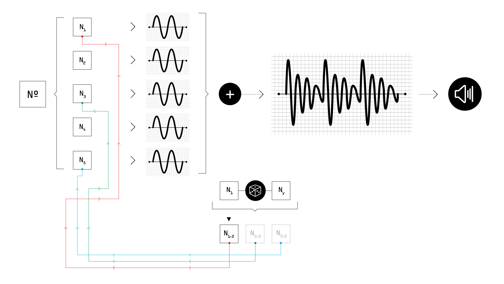

# Síntese Aditiva

>Implementação do método de síntese de aditiva, onde osciladores senoidais são somados de acordo com os valores de frequência de uma série harmônica, para posteriormente terem suas frequências alteradas, tornando o conteúdo espectral progressivamente mais inarmônico. 
 
>Esse projeto não possui video, apenas o código para download..

---

No campo do som, alguns tópicos de leitura relevantes para esse projeto:

* [Síntese aditiva](https://en.wikipedia.org/wiki/Additive_synthesis)
* [Interferência construtiva e destrutiva](http://www.phys.uconn.edu/~gibson/Notes/Section5_2/Sec5_2.htm)
* [Série harmônica](https://en.wikipedia.org/wiki/Harmonic)

No campo da computação, alguns tópicos de leitura relevantes para esse projeto:

* [Randomicidade](https://en.wikipedia.org/wiki/Randomness)
* [Loops](https://en.wikipedia.org/wiki/Control_flow#Loops)
* [Arrays](https://en.wikipedia.org/wiki/Array_data_type)
* [Métodos e orientação a objetos](https://en.wikipedia.org/wiki/Object-oriented_programming)

---

Os códigos e os samples desse projeto podem ser baixados [aqui.](https://drive.google.com/open?id=11VlvfHAiY2TV8H2c9-Y6CTgKt76QsMwF)

### Desafios sugeridos

É altamente recomendado que você explore e faça alterações, por conta própria, nos códigos apresentados nesse projeto. 
Aqui estão algumas sugestões de novas funcionalidades e/ou modificações que podem ser implementadas:

- Adicione controles de amplitude individuais para as parciais harmônicas e investigue as consequências disso para a forma de onda gerada, assim como no resultado sonoro.
- Crie um [envelope dinâmico](https://en.wikipedia.org/wiki/Synthesizer#Attack_Decay_Sustain_Release_(ADSR) onde os harmônicos possuem tempos distintos de decaimento. 
- Reproduza o resultado sonoro do primeiro minuto ouvido [aqui](https://www.youtube.com/watch?v=SZazYFchLRI).
- Implemente [LFOs](https://en.wikipedia.org/wiki/Low-frequency_oscillation) em algumas parciais harmônicas, de modo que seu valor de frequência não seja estático. 
